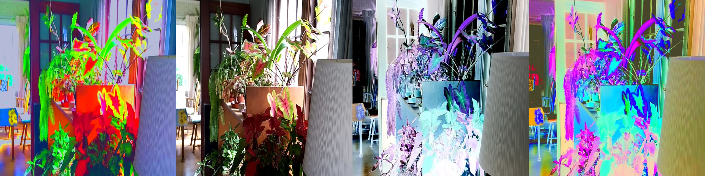

# BrightEyes

Spot details through your camera using principal components analysis and decorrelation stretch.

[Online version)(https://cedev.github.io/brighteyes/)

There are 5 modes, which are switched between by tapping the screen:

 - decorrelation stretch by covariance matrix
 - decorrelation stretch by correlation matrix
 - camera (no processing)
 - camera negative
 - decorrelation stretch of the negative by covariance

## Math 

All of the decorrelation modes use the input means and input variance as the target mean and variance for the output image.

The covariance matrix and means are calculated from a sample of 1000 random pixels in each frame.

## Development

Install [npm](https://www.npmjs.com/get-npm)

Run `npm install` in the root directory to install all dependencies.

### Web

Run `npm run watch` to build and update the javascript bundle.

Open `index.html` in a browser.
